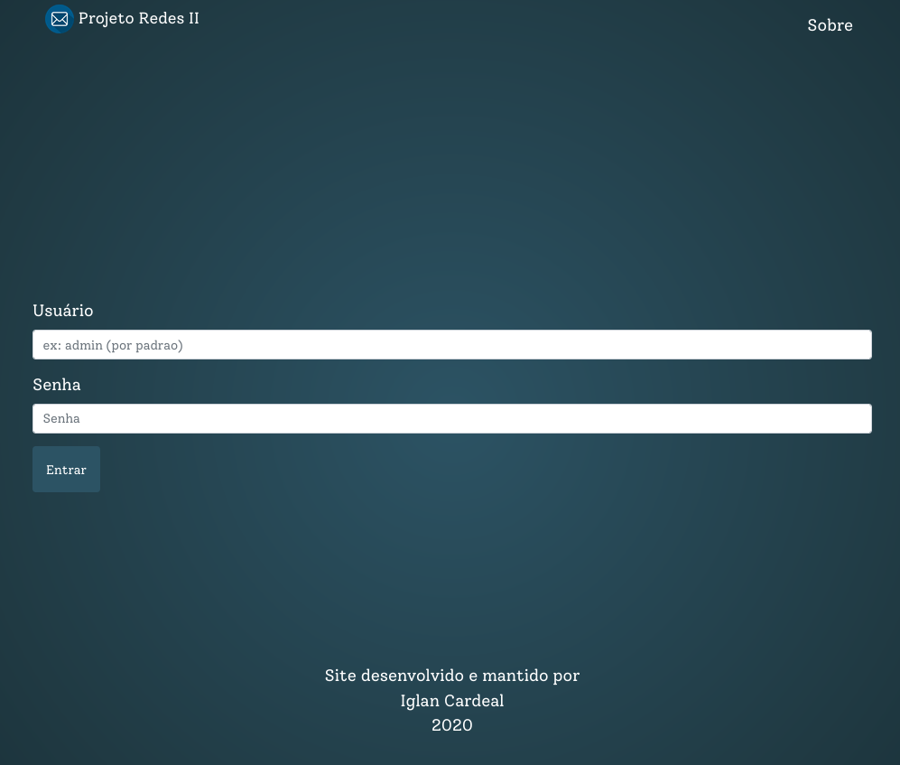
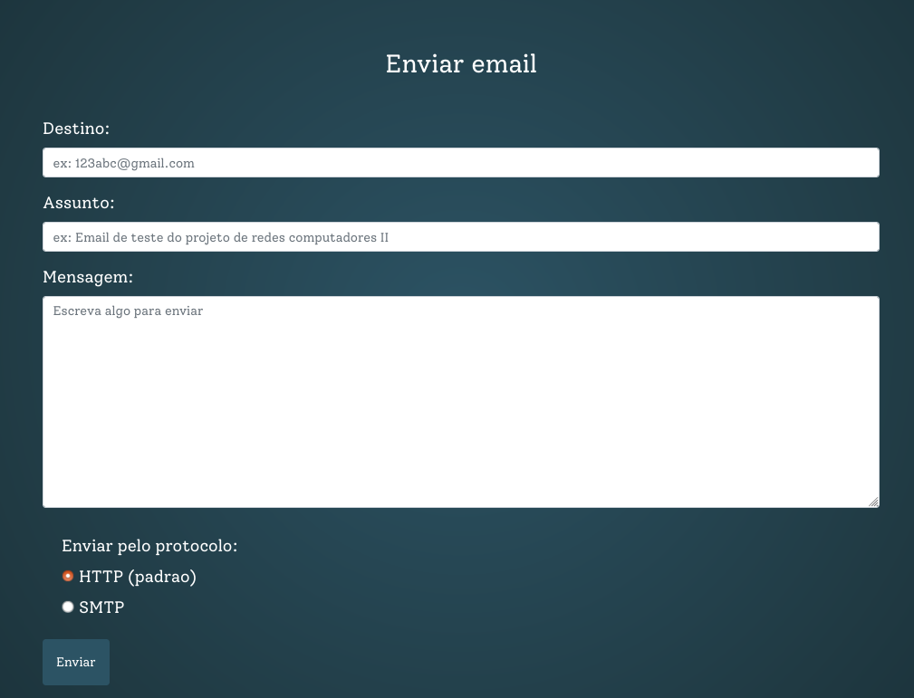
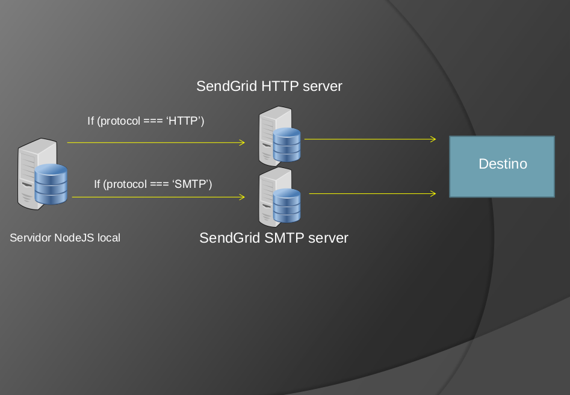
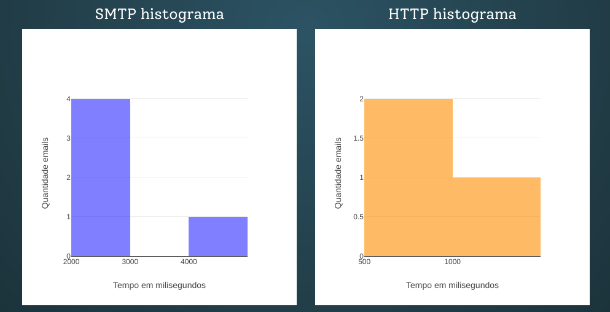
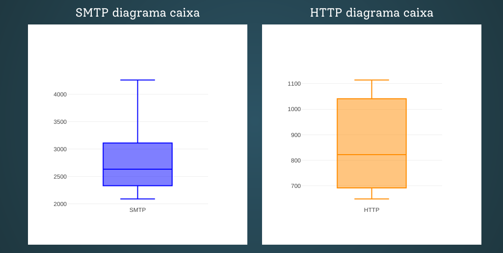

<div align="center">

<kbd>
  
</kbd>

# Email Performance App

<br>

## :email: Site para demonstrar desempenho de envio de email usando protocolos HTTP e SMTP.

</div>

<div align="center">

      

</div>

---

### Status do projeto

- Concluído :muscle:

### Tabela de conteúdos

<!--ts-->

- [Sobre](#sobre)
  - [Como é definido o protocolo de envio?](#protocolo-envio)
- [Features](#features)
- [Outlook não recebe email](#outlook-issue)
- [Como usar localmente](#como-usar)
  - [Requisitos](#como-usar)
    - [Configurando arquivo `.env`](#env)
    - [SendGrid](#sendgrid)
  - [Nao tenho mongodb instalado. E agora?🤔](#atlas)
    - [Atlas](#atlas)
    - [Container Docker](#docker)
- [Tecnologias/ferramentas usadas](#tecnologias)
- [Autor](#autor)
  <!--te-->

<p id="sobre"></p>

### Sobre :coffee:



A idéia desde projeto surgiu durante a atividade final da desciplina de _Redes de Computadores II_, do curso de _Engenharia da Computação_, onde o projeto escolhido foi um servidor de envio de email, onde este servidor deve fornecer métricas de tempo de desempenho de envio de email baseado no tipo de protocolo enviado, no caso dois protocolos foram usados para enviar email, `SMTP`e `HTTP`.

Este projeto consiste de uma aplicação web para envio de email baseando em protocolos de comunicação **HTTP** e **SMTP**. Além de pode escolher qual protocolo deseja enviar o email, este app possui um contador de tempo (em milisegundos) para que possa ser feita a análise de performance de cada protocolo durante o envio. Oferece o resultado de tempo médio de envio para cada protocolo e por fim, com base em todos os emails enviados, exibe gráfico para se ter uma comparação geral da performance.

Veja, logo abaixo, imagem do formulário de envio de email:



<p id="protocolo-envio"></p>

#### Como é definido o protocolo de envio?

Podemos escolher qual protocolo será usado no envio graças a biblioteca `nodemailer-sendgrid-transport`.
Código que define o protocolo de envio:

```javascript
const dotenv = require('dotenv');
const nodemailer = require('nodemailer');
const sendGrid = require('nodemailer-sendgrid-transport');

dotenv.config();

// para protocolo HTTP
exports.transport = nodemailer.createTransport(
  sendGrid({
    auth: {
      api_key: process.env.SENDGRID_API_KEY,
    },
  }),
);

// para protocolo SMTP
exports.transportOverSMTP = nodemailer.createTransport({
  service: 'SendGrid',
  auth: {
    user: process.env.SENDGRID_USERNAME,
    pass: process.env.SENDGRID_PASSWORD,
  },
});
```

E no `controller` da aplicação, verificamos o valor do input que escolhe o protocolo de envio, e assim fazemos o envio do email:

```javascript
if (protocol === 'HTTP') {
  transport.sendMail(sendEmailObject, (error, info) => {
    callback(error, info, 'HTTP');
  });
}

if (protocol === 'SMTP') {
  transportOverSMTP.sendMail(sendEmailObject, (error, info) => {
    callback(error, info, 'SMTP');
  });
}
```

Este site foi feito com as tecnologias: MongoDB, NodeJS e, principalmente, faz o uso da API SendGrid através do Nodemailer para envio de emails sob os protocolos HTTP e SMTP. Os emails submetidos pelo usuário, são enviados ao servidor NodeJS e este armazena dados do email como protocolo, data de envio e protocolo usado, no banco de dados MongoDB antes de os enviar através da API do SendGrid.



Veja mais sobre protocolo a ser usado com **SendGrid** e **Nodemailer**:

- [Sending Email With Nodemailer and SendGrid](https://sendgrid.com/blog/sending-email-nodemailer-sendgrid/)

<p id="features"></p>

### Features 📋

Nesta aplicação voçê pode:

- Enviar email escolhendo o protocolo a ser usado (`SMTP`/`HTTP`)

- Visualizar o histórico de envio, onde é informado:

  1. Data de envio
  2. Email de destino(Destino)
  3. Protocolo usado no envio
  4. Status do envio onde:

     - <span style="color: yellow; text-shadow: 1px 1px 1px black">Pendente</span>: Email foi entregue ao serviço do SendGrid, mas o mesmo ainda não foi entregue ao destinatário.

     - <span style="color: green; text-shadow: 1px 1px 1px black">Enviado</span>: Email entregue ao destinatário.

     - <span style="color: red; text-shadow: 1px 1px 1px black">Falha ao enviar</span>: Falhou ao enviar email.

  5. Tempo decorrigo do procedimento em milisegundos

  Exemplo de status de envio:

  ```bash
    Data envio: 09/11/2020 as 11:52 horas
    Destino: cubeleexuzz@gmail.com
    Protocolo: HTTP
    Status: Pendente
    Tempo decorrido: 0 milisegundos
  ```

- Visualizar os números de desempenho do tempo decorrido para cada protocolo. Os dados são exibidos para comparação em:

  - Gráfico:

    

  - Histograma:

    

  - Diagrama de caixa:

    

<p id="outlook-issue"></p>

### Problema com Outlook 👾

O envio de emails podem não funciona para destinatários com provedores Outloook/Hotmail. Pequisando sobre o erro, encontrei algumas informações [neste link](https://www.reddit.com/r/webdev/comments/amzfhg/outlookhotmail_blocking_my_sendgrid_emails/).

> I’ve seen the same thing it looks like providers are blocking the IP range of SendGrid’s “free” plans.Assuming you authenticated your emails properly and followed SPF, dkim and DMARC then the only other solution is to upgrade your account to a dedicated IP and hope that range isn't blacklisted.

Basicamente o que é dito:

> ALguns provedores estão bloqueando os IP's do planos gratuitos do SendGrid. A solução seria mudar para o plano pago para obter um IP dedicado e este IP não está na lista de IP's bloqueados dos provedores.

Ou pode ser necessário ajustar a autenticação de dominio no site do SendGrid.

> You have to do this: https://sendgrid.com/docs/ui/account-and-settings/how-to-set-up-domain-authentication/

Para não ter todo o trabalho de ter que configurar ou mudar de plano, é <b>ALTAMENTE RECOMENDADO QUE OS DESTINATÁRIOS SEJAM EMAILS PROVIDOS PELO SERVIÇO DO GOOGLE, OU SEJA, USE DESTINATÁRIOS `@gmail.com`</b>, assim os email serão recebidos e não serão bloqueados pelo provedor.

Em todos os testes feitos por mim, os email enviados para `*@gmail.com`, foram recebidos.

<p id="como-usar"></p>

### Como usar localmente? :pushpin:

<p id="requisitos"></p>

#### Requisitos

Para usar localmente em sua máquina, voce deve ter instalado em sua máquina o [NodeJS](https://nodejs.org/en/) com uma versão minima recomendada `v12.0.0`, [MongoDB](https://www.mongodb.com/) e o [Git](https://git-scm.com).
Além disto é bom ter um editor para trabalhar com o código como [VSCode](https://code.visualstudio.com/).
Para começar, faça o clone deste repositório. Digite o comando no terminal:

```bash
$ git clone https://github.com/IglanCardeal/performance-email-app
```

Acesse a pasta do projeto:

```bash
$ cd performance-email-app
```

Instale as dependências do projeto usando o `npm` ou `yarn` se preferir:

```bash
$ npm install
# ou
$ yarn install
```

<p id="env"></p>

Agora precisamos configurar o arquivo `.env`, que contém as variáveis de ambientes essenciais para executar a aplicação. Neste respositório, temos um arquivo de exemplo das variáveis de ambiente chamado `.env,example`. Abra esse arquivo e veremos o seguinte:

```bash
# APP detalhes
APP_NAME= App Envio de Email
APP_AUTHOR= Iglan Cardeal
APP_EMAIL= emailperformanceapp@teste.com

# APP Port
PORT= 3000
HOST= localhost

# Database MongoDB
DB_NAME=app-envio-email
DB_PORT=27017

# Quando NODE_ENV=development
DB_DEV_HOST=127.0.0.1
# Quando NODE_ENV=production
DB_HOST=127.0.0.1
# URL Provedor externo
DB_HOST_EXTERNAL=


# SendGrid account API key
SENDGRID_API_KEY= <sua KEY do SendGrid>

# SendGrid accounts
SENDGRID_USERNAME= <seu usuario do SendGrid>
SENDGRID_PASSWORD= <sua senha do SendGrid>
```

<p id="sendgrid"></p>

#### SendGrid API Key

Vamos ajustar o essencial. As chaves para uso da API do SendGrid são importantes para uso do serviço de envio de email.
Voçê pode gerar uma chave de API no site [SendGrid](https://sendgrid.com/). Após realizar os cadastros e gerar a sua chave da API, faça os ajustes inserindo seus dados:

```bash
SENDGRID_API_KEY= <sua KEY do SendGrid>

SENDGRID_USERNAME= <seu usuario do SendGrid>
SENDGRID_PASSWORD= <sua senha do SendGrid>
```

<p id="env"></p>

Agora, renomeie o arquivo `.env.example` para `.env`.

Feito isso, execute o comando abaixo e o aplicativo será iniciado localmente como ambiente de desenvolvimento em sua máquina:

```bash
$ npm run dev
# ou
$ yarn dev
```

Agora abra seu navegador na URL `http://localhost:3000` e verá a página inicial do projeto.

<p id="atlas"></p>

#### Não tem MongoDB instalado?

Sem problemas! 

#### Atlas

Voçê pode inserir uma URI de algum provedor como o [Atlas](https://www.mongodb.com/cloud/atlas/lp/try2?utm_source=google&utm_campaign=gs_americas_brazil_search_brand_atlas_desktop&utm_term=mongodb&utm_medium=cpc_paid_search&utm_ad=e&utm_ad_campaign_id=1718986516). Neste caso, vamos definir um URI no em `DB_HOST_EXTERNAL=`. Esta variável tem prioridade, logo se voçê definiu uma URI, ela será usada, senão deixea vazia.
A URI a ser usada, no caso se voçê usar o Atlas, terá o formato semelhante a seguir:

```bash
DB_HOST_EXTERNAL=mongodb+srv://<username>:<password>@cluster0.zcr3z.mongodb.net/<dbname>?retryWrites=true&w=majority
```

Onde:

- `username`: seu nome de usuário

- `password`: sua senha

- `dbname`: nome da base de dados. Eu recomendo chamar de `email-performance-app`

Tendo Feito todas as configurações, execute `npm run dev` ou `yarn dev` para iniciar a aplicação.

**_OBS_**: ao executar o comando para iniciar a aplicação, será exibido no terminal a URI de conexão com o banco.

<p id="docker"></p>

#### Voçê usa Docker? :whale:

Uma solução alternativa é subir um container do Docker do MongoDB. Existe a [imagem oficial do mongo](https://hub.docker.com/_/mongo) que podemos usar para subir um container mongodb e usar o banco de dados.
Na raíz do projeto temos um arquivo `docker-compose.yml` com as seguintes características:

```bash
version: '3'
services:
  mongo:
    container_name: db_app-envio-email
    image: mongo
    restart: always
    ports:
      - ${DB_PORT}:27017
```

Esse arquivo é a base para gerar um container do mongodb.
Temos também um arquivo `Makefile` para que possamos executar comandos do `docker-compose` de uma maneira mais rápida.
Características do `Makefile`:

```bash
include .env

.PHONY: up

up:
  docker-compose up -d

.PHONY: down

down:
  docker-compose down

.PHONY: logs

logs:
  docker-compose logs -f
```

- `include .env` carrega as variáveis de ambiente do arquivo `.env`.

- `up` executa o `docker-compose` com os containers em background

- `logs` exibe os logs

- `down` desmonta os containers

Para subir o container, digite no terminal `make up`, e aguarde o docker baixar e montar a imagem do mongodb.

Ao finalizar, execute `make logs`, para verificar se tudo ocorreu bem nos logs.

Execute `make down` para desmontar o container.

***OBS***: Para a aplicação se conectar com o container do mongodb, a varável `DB_HOST_EXTERNAL` não pode estar definida.

### Quais tecnologias foram usadas? :wrench:

<p id="tecnologias"></p>

- [NodeJS](https://nodejs.org/en/)
- [Express](https://expressjs.com/pt-br/) (Framework web)
- [Ejs](https://ejs.co/) (Template engine)
- [SendGrid](https://sendgrid.com)
- [MongoDB](https://www.mongodb.com/)
- [Docker](https://www.docker.com/)
- [PM2](https://pm2.keymetrics.io/) (Para clusterização em produção)
- [Bootstrap](https://getbootstrap.com/) (Framework CSS)
- [Git](https://git-scm.com)
- [VSCode](https://code.visualstudio.com/)

### Autor

<p id="autor"></p>

<kbd>
 
</kbd>

<b>Iglan Cardeal</b>

Desenvolvido e mantido por Iglan Cardeal :hammer: </br>
Desenvolvedor NodeJS 💻 <br>
Entre em contato! 👋🏽

- cmtcardeal@outlook.com :email:
- Instagram [@cmtcardeal](https://www.instagram.com/cmtecardeal/)
- StackOverflow [Cmte Cardeal](https://pt.stackoverflow.com/users/95771/cmte-cardeal?tab=profile)
